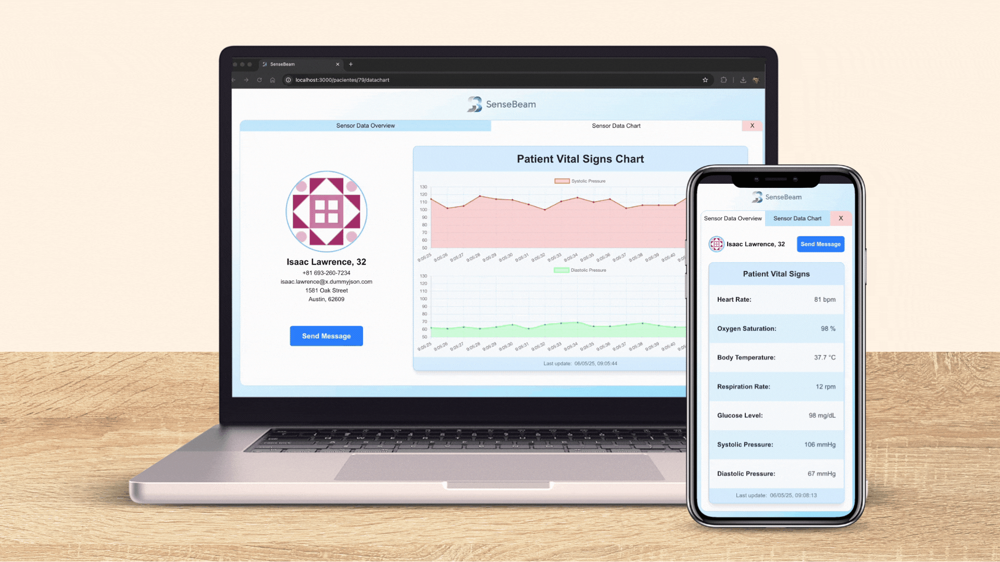

<a id="readme-top"></a>


<div align="right">
  
</div>

# SenseBeam

<br />

<div align="center">
    
</div>
<br />

**SenseBeam** is a web application built with React (Next.js) that allows users to view key telemetry data about patients. It is designed with a clean, responsive interface for easy navigation and data visualization, ideal for healthcare professionals.

## 📋 &nbsp; Table of Contents

1. [Project Overview](#project-overview)
2. [Data Management](#data)
3. [Features](#features)
4. [Installation](#installation)
5. [Technologies Used](#tech)
6. [Contact](#contact)

## 🚀 &nbsp; <a id="project-overview">Project Overview</a>

- **List of patients** displayed in a main view with selection capability.
- **Patient profile** accessible by selecting a patient, showing:
  - **Sensor Overview Tab**: Displays key and relevant sensor data.
  - **Sensor Chart Tab**: Provides an interactive chart of sensor values over time.

<p align="right">(<a href="#readme-top">back to top</a>)</p>

## 📦 &nbsp; <a id="data">Data Management</a>

- **Patient data** is fetched from this fake REST API:  
  [`https://dummyjson.com/users`](https://dummyjson.com/users)

- **Sensor data** is retrieved via WebSockets from a simulated telemetry API that I developed:   
  [`https://github.com/JonaRhood/telemetry-ws-mock-api`](https://github.com/JonaRhood/telemetry-ws-mock-api)  

<p align="right">(<a href="#readme-top">back to top</a>)</p>

## ✨ &nbsp; <a id="features">Features</a>

- **Modern and responsive design** using **TailwindCSS**, ensuring a smooth experience across desktops, tablets, and mobile devices.  
- **State management** with **Redux**, allowing efficient handling of complex data flows and UI states.  
- **Data visualization** with **Chart.js**, providing intuitive charts and graphs for better interpretation of patient metrics.  
- **Real-time updates** using **WebSockets**, delivering live telemetry data to the interface without the need for manual refresh.  
- **Deployment to Azure**, ensuring secure, scalable, and reliable cloud hosting.

<p align="right">(<a href="#readme-top">back to top</a>)</p>

## 🔧  &nbsp; <a id="installation">Installation</a>

```bash
# Clone the repository
git clone https://github.com/JonaRhood/SenseBeam.git

# Navigate into the project folder
cd sensebeam

# Install dependencies
npm install

# Run the development server
npm next dev
```

<p align="right">(<a href="#readme-top">back to top</a>)</p>

## ⚙️ &nbsp; <a id="tech">Technologies Used</a>

[![NEXT.JS][NEXT.js]][NEXTJS-url]
[![REACT][REACT.js]][REACT-url]
[![REDUX][REDUX.js]][REDUX-url]
[![CHARTJS][CHART.js]][Chart-url]
[![TYPESCRIPT][TYPESCRIPT.js]][TYPESCRIPT-url]
[![JAVASCRIPT][JAVASCRIPT.js]][JAVASCRIPT-url]
[![TAILWIND][TAILWIND]][TAILWIND-URL]
[![CSS][CSS.js]][CSS-url]
[![HTML5][HTML5.js]][HTML5-url]
[![GIT][GIT.js]][GIT-url]
[![AZURE][AZURE]][AZURE-url]

<p align="right">(<a href="#readme-top">back to top</a>)</p>

## 👤 &nbsp; <a id="contact">Contact</a>

<a href="https://github.com/JonaRhood/reddit-client/graphs/contributors">
  
</a>

[![LinkedIn][linkedin-shield]][linkedin-url] <br />
Jonathan Cano -  jonathancanofreta@gmail.com

<p align="right">(<a href="#readme-top">back to top</a>)</p>

[product-screenshot]: ./src/resources/img/screen2.png
[linkedin-shield]: https://img.shields.io/badge/-LinkedIn-blue.svg?style=for-the-badge&logo=linkedin&colorBlue
[linkedin-url]: https://www.linkedin.com/in/jonathancanocalduch
[React.js]: https://img.shields.io/badge/React-20232A?style=for-the-badge&logo=react&logoColor=61DAFB
[React-url]: https://reactjs.org/
[Azure]: https://img.shields.io/badge/Microsoft%20AZURE-20232A?style=for-the-badge&logo=data:image/svg+xml;base64,PHN2ZyB4bWxucz0iaHR0cDovL3d3dy53My5vcmcvMjAwMC9zdmciIHdpZHRoPSIxNTAiIGhlaWdodD0iMTUwIiB2aWV3Qm94PSIwIDAgOTYgOTYiPjxkZWZzPjxsaW5lYXJHcmFkaWVudCBpZD0iZTM5OWMxOWYtYjY4Zi00MjlkLWIxNzYtMThjMjExN2ZmNzNjIiB4MT0iLTEwMzIuMTcyIiB4Mj0iLTEwNTkuMjEzIiB5MT0iMTQ1LjMxMiIgeTI9IjY1LjQyNiIgZ3JhZGllbnRUcmFuc2Zvcm09Im1hdHJpeCgxIDAgMCAtMSAxMDc1IDE1OCkiIGdyYWRpZW50VW5pdHM9InVzZXJTcGFjZU9uVXNlIj48c3RvcCBvZmZzZXQ9IjAiIHN0b3AtY29sb3I9IiMxMTRhOGIiLz48c3RvcCBvZmZzZXQ9IjEiIHN0b3AtY29sb3I9IiMwNjY5YmMiLz48L2xpbmVhckdyYWRpZW50PjxsaW5lYXJHcmFkaWVudCBpZD0iYWMyYTZmYzItY2E0OC00MzI3LTlhM2MtZDRkY2MzMjU2ZTE1IiB4MT0iLTEwMjMuNzI1IiB4Mj0iLTEwMjkuOTgiIHkxPSIxMDguMDgzIiB5Mj0iMTA1Ljk2OCIgdHJhbnNmb3JtPSJtYXRyaXgoMSAwIDAgLTEgMTA3NSAxNTgpIiBncmFkaWVudFVuaXRzPSJ1c2VyU3BhY2VPblVzZSI+PHN0b3Agb2Zmc2V0PSIwIiBzdG9wLW9wYWNpdHk9Ii4zIi8+PHN0b3Agb2Zmc2V0PSIwLjA3MSIgc3RvcC1vcGFjaXR5PSIuMiIvPjxzdG9wIG9mZnNldD0iLjMyMSIgc3RvcC1vcGFjaXR5PSIuMSIvPjxzdG9wIG9mZnNldD0iLjYyMyIgc3RvcC1vcGFjaXR5PSIuMDUiLz48c3RvcCBvZmZzZXQ9IjEiIHN0b3Atb3BhY2l0eT0iMCIvPjwvbGluZWFyR3JhZGllbnQ+PGxpbmVhckdyYWRpZW50IGlkPSJhN2ZlZTk3MC1hNzg0LTRiYjEtYWY4ZC02M2QxOGU1ZjdkYjkiIHgxPSItMTAyNy4xNjUiIHgyPSItOTk3LjQ4MiIgeTE9IjE0Ny42NDIiIHkyPSI2OC41NjEiIHRyYW5zZm9ybT0ibWF0cml4KDEgMCAwIC0xIDEwNzUgMTU4KSIgZ3JhZGllbnRVbml0cz0idXNlclNwYWNlT25Vc2UiPjxzdG9wIG9mZnNldD0iMCIgc3RvcC1jb2xvcj0iIzNjY2JmNCIvPjxzdG9wIG9mZnNldD0iMSIgc3RvcC1jb2xvcj0iIzI4OTJkZiIvPjwvbGluZWFyR3JhZGllbnQ+PC9kZWZzPjxwYXRoIGZpbGw9InVybCgjZTM5OWMxOWYtYjY4Zi00MjlkLWIxNzYtMThjMjExN2ZmNzNjKSIgZD0iTTMzLjMzOCA2LjU0NGgyNi4wMzhsLTI3LjAzIDgwLjA4N2E0LjE1MiA0LjE1MiAwIDAgMS0zLjkzMyAyLjgyNEg4LjE0OWE0LjE0NSA0LjE0NSAwIDAgMS0zLjkyOC01LjQ3TDI5LjQwNCA5LjM2OGE0LjE1MiA0LjE1MiAwIDAgMSAzLjkzNC0yLjgyNXoiLz48cGF0aCBmaWxsPSIjMDA3OGQ0IiBkPSJNNzEuMTc1IDYwLjI2MWgtNDEuMjlhMS45MTEgMS45MTEgMCAwIDAgLTEuMzA1IDMuMzA5bDI2LjUzMiAyNC43NjRhNC4xNzEgNC4xNzEgMCAwIDAgMi44NDYgMS4xMjFoMjMuMzh6Ii8+PHBhdGggZmlsbD0idXJsKCNhYzJhNmZjMi1jYTQ4LTQzMjctOWEzYy1kNGRjYzMyNTZlMTUpIiBkPSJNMzMuMzM4IDYuNTQ0YTQuMTE4IDQuMTE4IDAgMCAwLTMuOTQzIDIuODc5TDQuMjUyIDgzLjkxN2E0LjE0IDQuMTQgMCAwIDAgMy45MDggNS41MzhIMjUuNzM5YTQuNDQzIDQuNDQzIDAgMCAwIDMuNDEtMi45bDUuMDE0LTE0Ljc3NyAxNy45MSAxNi43MDVhNC4yMzcgNC4yMzcgMCAwIDAgMi42NjYuOTcySDgxLjI0TDU2LjQyNCA2MC4yNjFsLTI5Ljc4MS4wMDdMNTkuNDcgNi41NDR6Ii8+PHBhdGggZmlsbD0idXJsKCNhN2ZlZTk3MC1hNzg0LTRiYjEtYWY4ZC02M2QxOGU1ZjdkYjkpIiBkPSJNNjYuNTk1IDkuMzY0YTQuMTQ1IDQuMTQ1IDAgMCAwLTMuOTI4LTIuODJIMzMuNjQ4YTQuMTQ2IDQuMTQ2IDAgMCAxIDMuOTI4IDIuODJsMjUuMTg0IDc0LjYyYTUuMTYgNS4xNiAwIDAgMS00LjYzNCA2LjQ3MmgzOS4wMmE0LjE0NiA0LjE0NiAwIDAgMCAzLjkyNy01LjQ3MnoiLz48L3N2Zz4=
[Azure-url]: https://azure.microsoft.com/es-es
[Chart.js]: https://img.shields.io/badge/Chart.js-20232A?style=for-the-badge&logo=chartdotjs
[Chart-url]: https://www.chartjs.org/
[Tailwind]: https://img.shields.io/badge/Tailwind%20css-20232A?style=for-the-badge&logo=tailwindcss
[Tailwind-url]: https://tailwindcss.com/
[Redux.js]: https://img.shields.io/badge/Redux-20232A?style=for-the-badge&logo=redux&logoColor=violet
[Redux-url]: https://redux.js.org/
[Next.js]: https://img.shields.io/badge/NEXT.JS-20232A?style=for-the-badge&logo=next.js&logoColor=white
[nextjs-url]: https://nextjs.org/
[typescript.js]: https://img.shields.io/badge/TYPESCRIPT-20232A?style=for-the-badge&logo=typescript&logoColor=blue
[typescript-url]: https://www.typescriptlang.org/
[Javascript.js]: https://img.shields.io/badge/Javascript-20232A?style=for-the-badge&logo=JavaScript&logoColor=Y
[Javascript-url]: https://developer.mozilla.org/es/docs/Web/JavaScript
[Jest.js]: https://img.shields.io/badge/Jest.js-20232A?style=for-the-badge&logo=jest&logoColor=orange
[Jest-url]: https://jestjs.io/
[CSS.js]: https://img.shields.io/badge/CSS-20232A?style=for-the-badge&logo=css&logoColor=306af1
[CSS-url]: https://developer.mozilla.org/es/docs/Web/CSS
[HTML5.js]: https://img.shields.io/badge/HTML5-20232A?style=for-the-badge&logo=html5&logoColor=e8571f
[HTML5-url]: https://developer.mozilla.org/es/docs/Glossary/HTML5
[Git.js]: https://img.shields.io/badge/git-20232A?style=for-the-badge&logo=git&logoColor=e8571f
[Git-url]: https://git-scm.com/
